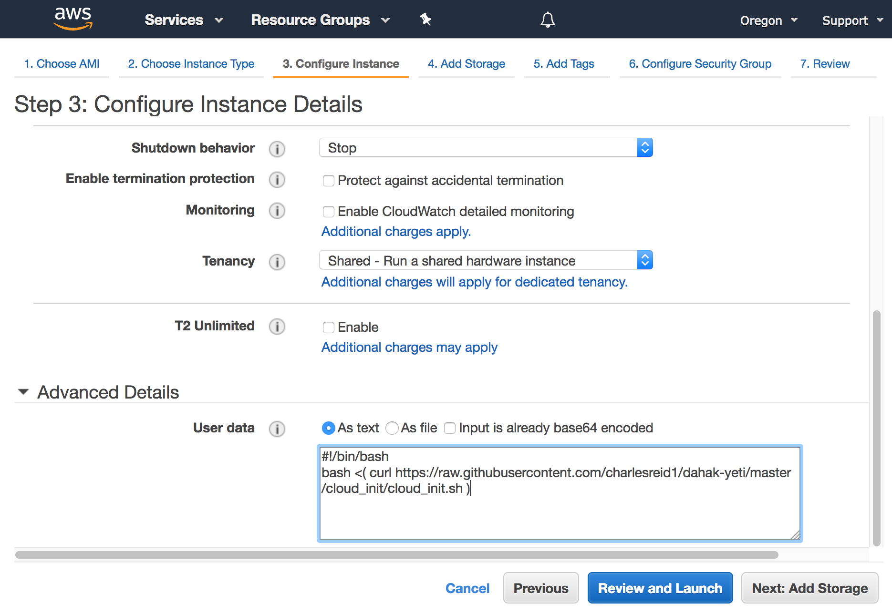
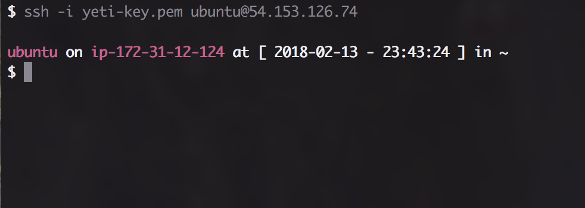

# AWS Setup for Walkthroughs

This workflow covers getting set up with 
worker nodes, if you don't already have a
cluster ready to go. 

In this document we will:

* Prepare a beefy worker node to run a 
    dahak workflow by installing required software 
    from the dahak-yeti repository.

We will cover AWS in this document, although 
taco can be used with various HPC and cloud 
platforms.

## Console

Log into the AWS console and select EC2.  Select a region (`us-west-2` Oregon is good for spot instances).

### Create Instance

Use the big blue button to create a new EC2 instance.

### Amazon Machine Image

Select the stock Ubuntu 16.04 LTS image from the list of AMIs.
This has the AMI ID:

```
ami-4e79ed36
```

### Node Type

The hardware depends highly on the worfklow
(more results soon from benchmarking of workflows),
but for all walkthroughs we utilize one of the following:

* `m5.2xlarge` (8 vCPUs, 32 GB RAM) 
* `m5.4xlarge` (16 vCPUs, 64 GB RAM)

### Configuring Instance Details

On the configure instance details:

* Check "Request Spot Instances" box and set your desired price
    * Typical price for 2xlarge is 14 cents per hour
    * Typical price for 4xlarge is 28 cents per hour

* Click the Advanced Details bar at the bottom

* Copy the following into the user data text box:

```
#!/bin/bash
bash <( curl https://raw.githubusercontent.com/charlesreid1/dahak-yeti/master/cloud_init/cloud_init.sh )
```



* The pipe-to-bash one-liner will run the cloud init script 
    in the [dahak-yeti](https://github.com/dahak-metagenomics/dahak-yeti) repo

### Volumes

A 256 GB hard disk (EBS, the default) should be sufficient.

### Logging Into Instance

When you create the node it should set up a private key
to use to SSH into the worker node.

The init script will add a few minutes to the worker node's 
startup time. It will run scripts, install files, set configurations,
and run a lot of magic.

Once the startup step has completed, you can SSH to the
worker node, and you will have the following installed:

* pyenv
* miniconda3-4.30 installed with pyenv
* snakemake installed with conda
* opinionated dotfiles (`.bashrc`, `.bash_profile`, `.vimrc`, etc.)
* a colorful pink prompt




